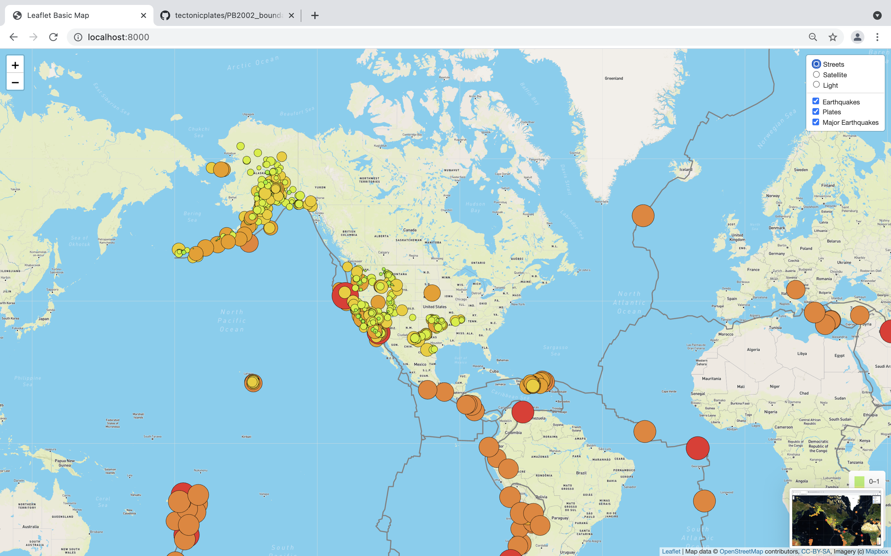
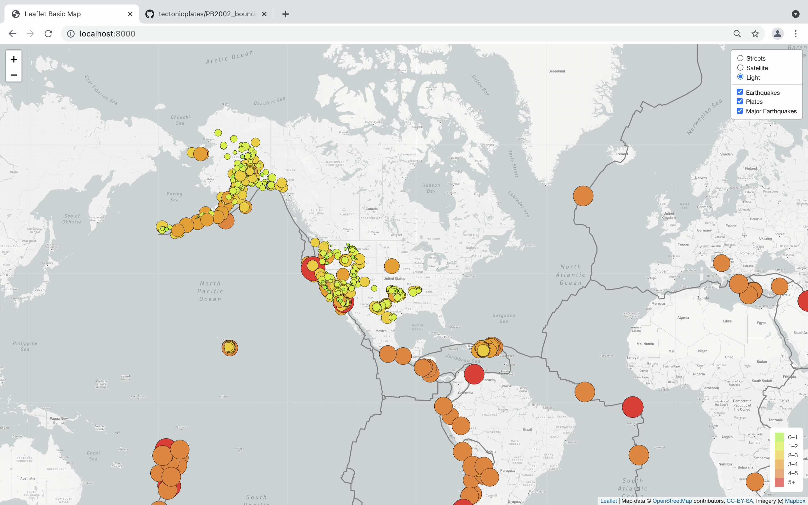

# Mapping Earthquakes

### Overvies
Using earthquake data for the last 7 day from the USGS along with style options from Mapbox and layering of maps from Leaflet.js maps were created that show the earthquakes of various magnitudes over the last week.

### Output
Below you can see the three different style options for the data, Street view, Satellite view and Light view. 

 
 
 
